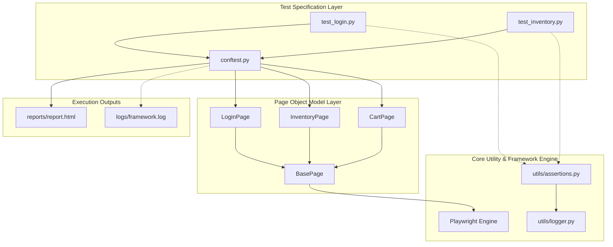
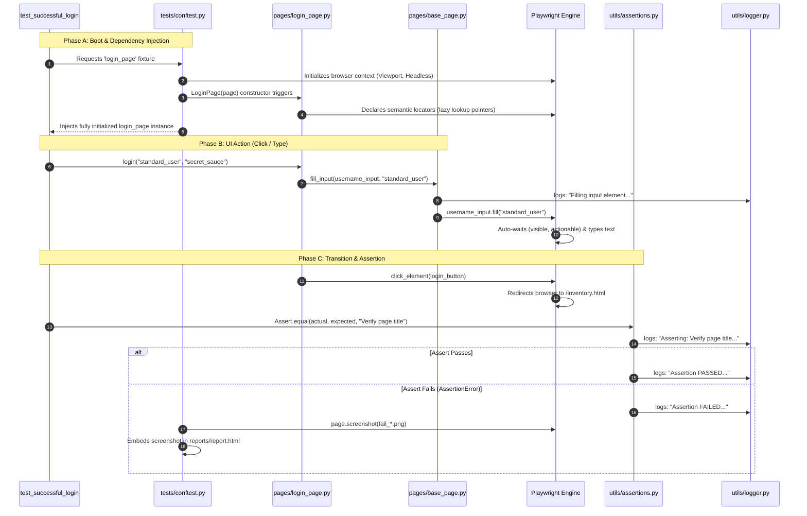

# Framework Architecture, Design Patterns, and OOP Concepts

This document is designed to help the engineering team fully understand the foundational software engineering design principles, Object-Oriented Programming (OOP) concepts, and design patterns that make this E2E test automation framework highly scalable, maintainable, and robust.

---

## 1. High-Level System Architecture

The framework relies on a multi-tiered architecture that separates test specifications, business pages, configurations, and core runner utilities:

---

## 2. Object-Oriented Programming (OOP) Concepts Applied

This framework is built strictly around core Object-Oriented Programming principles, demonstrating solid engineering practices. Below is a breakdown of how each OOP concept is implemented in our codebase:

### A. Inheritance (Parent-Child Relationships)
Inheritance allows a class to acquire properties and methods of another class, promoting code reuse.
* **Implementation**: The parent class `BasePage` (`pages/base_page.py`) contains general browser actions like `click_element()`, `fill_input()`, and `navigate_to()`.
* **Application**: Classes like `LoginPage`, `InventoryPage`, and `CartPage` inherit directly from `BasePage` (`class LoginPage(BasePage):`). This allows them to reuse all interaction, waiting, and logging routines without rewriting them.

### B. Encapsulation (Information Hiding)
Encapsulation hides the internal details of a class and restricts direct access, exposing only necessary interfaces (methods) to the outside world.
* **Implementation**: We declare elements and locators within page constructors (e.g., `self.username_input` and `self.password_input` in `LoginPage`).
* **Application**: Test classes have **zero awareness** of the actual CSS selectors or accessibility names used to identify fields on a webpage. If the username input field changes from a placeholder to an ID, only the `LoginPage` class is updated. The tests simply call the public interface: `login_page.login(username, password)`.

### C. Abstraction (Hiding Complexity)
Abstraction simplifies complex realities by modeling classes appropriate to the problem, hiding low-level details.
* **Implementation**: Playwright requires explicit handling of actions like scrolling into view, waiting for elements to be stable, clearing fields, and writing strings. We abstract these low-level interactions inside `BasePage.fill_input()`.
* **Application**: A test developer writing `test_login.py` does not need to worry about Playwright-specific wait timers or tracebacks. They interact with simple, high-level methods like `login()`, which abstracts away multiple low-level Playwright element handles and actions.

### D. Polymorphism (Multiple Forms)
Polymorphism allows objects of different classes to be treated as objects of a common superclass, or allows methods to take different parameter structures.
* **Implementation**: Our custom `click_element` or `fill_input` wrappers dynamically accept a standard Playwright `Locator` regardless of whether it is generated via `.get_by_role()`, `.get_by_placeholder()`, or `.locator()`. 
* **Application**: We can also override default timeouts easily on a case-by-case basis (e.g., calling `is_element_visible(locator, timeout_ms=500)` vs default `2000ms`), showcasing method parameter-based behavior adjustment.

---

## 3. Core Software Design Patterns Applied

### A. Page Object Model (POM) Pattern
* **Concept**: Creates an object repository for web elements. Each page in the web app has an associated Page Class that encapsulates page-specific elements and actions.
* **Why it matters**: Drastically reduces code duplication, makes tests highly readable, and dramatically simplifies maintenance.

### B. Singleton Pattern (Logger)
* **Concept**: Restricts the instantiation of a class to a single, globally accessible instance.
* **Implementation**: In `utils/logger.py`, we implement a `FrameworkLogger` class with a thread-locked (`threading.Lock`) `get_logger()` classmethod.
* **Why it matters**: Ensures only one logger instance is configured and active across the entire test suite, even when executing parallel test threads via `pytest-xdist`. This prevents race conditions and corrupted, overlapping logging files.

### C. Facade / Wrapper Pattern (Assertions & Page Actions)
* **Concept**: Provides a simplified interface to a larger, more complex body of code.
* **Implementation**: 
  - `Assert` (`utils/assertions.py`): Wraps standard Pytest assertions, integrating them directly with stdout logs, file outputs, and screenshots on failure.
  - `BasePage` (`pages/base_page.py`): Wraps Playwright's low-level engine methods in clean, robust APIs.
* **Why it matters**: Streamlines test building for engineers by providing standard, expressive assertion APIs that handle reporting, screenshots, and logs behind the scenes.

---

## 4. End-to-End Test Execution Lifecycle

To understand how the different layers of the framework coordinate, let's examine the lifecycle of a typical UI test from launch to teardown:

### Detailed Lifecycle Phases:

* **Phase A: Pytest Boot & Dependency Injection**: 
  Pytest scans the tests and resolves parameter dependencies via fixtures in `conftest.py`. It instantiates the active Playwright browser driver context. It then instantiates page objects like `LoginPage(page)`. Element definitions (locators) are instantiated lazily—they do not fetch DOM nodes until an action is performed, keeping initialization extremely lightweight.
  
* **Phase B: Low-Level Browser Actions & Auto-Waiting**: 
  When the test calls page actions (e.g. `login()`), they invoke the generic wrappers in `BasePage` which output centralized logs. The Playwright engine then auto-waits for the target elements (verifying they are present, visible, stable, enabled, and receiving pointer events) before clicking or filling. This completely avoids flakey wait timeouts or thread-sleep statements.
  
* **Phase C: Page Redirection & Lazy Assertions**:
  When redirection triggers, Playwright manages browser navigation. When assertions execute (e.g. `Assert.equal`), the page objects dynamically query the current DOM to extract the active text content.
  
* **Phase D: Custom Audit Logging & Failure Capturing**:
  The `Assert` utility registers the validation check to the running log files (`logs/framework.log`). If an check fails, an `AssertionError` is raised, prompting `tests/conftest.py`'s `pytest_runtest_makereport` teardown hook to intercept the failure, capture a screenshot of the active browser screen, and embed it as an interactive visual attachment in the HTML report before closing the browser context.

---

## 5. Architectural Summary for the Team

| Architectural Component | File Location | Design Pattern / OOP Applied | Role in Framework |
| :--- | :--- | :--- | :--- |
| **Base Page Driver** | `pages/base_page.py` | Abstraction, Wrapper | Handles low-level Playwright commands with automatic waits and custom logging. |
| **Page Objects** | `pages/login_page.py`, etc. | POM, Inheritance, Encapsulation | Represents UI layout structures and encapsulates specific business flows. |
| **Custom Logger** | `utils/logger.py` | Singleton Pattern | Thread-safe recorder writing colored messages to console and logs to rolling files. |
| **Custom Assertions** | `utils/assertions.py` | Facade Pattern | High-level assertions that report validations (PASS/FAIL) to the logger automatically. |
| **Configuration Hook** | `tests/conftest.py` | Hook / Dependency Injection | Instantiates page dependencies and intercepts test failures to capture/attach screenshots to reports. |

