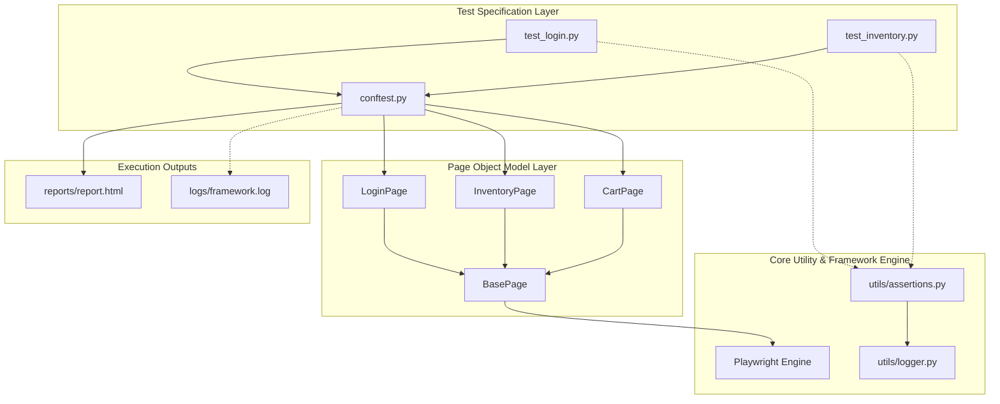
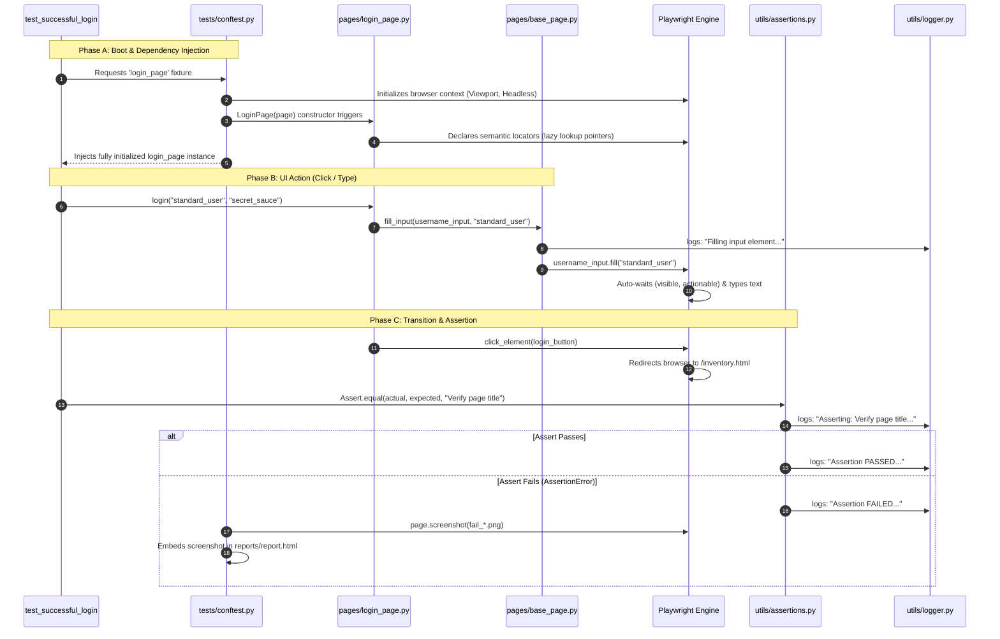

# Framework Architecture, Design Patterns, and OOP Concepts

This document is designed to help the engineering team fully understand the foundational software engineering design principles, Object-Oriented Programming (OOP) concepts, and design patterns that make this E2E test automation framework highly scalable, maintainable, and robust.

---

## 1. High-Level System Architecture

The framework relies on a multi-tiered architecture that separates test specifications, business pages, configurations, and core runner utilities:



---

## 2. Object-Oriented Programming (OOP) Concepts Applied

This framework is built strictly around core Object-Oriented Programming principles, demonstrating solid engineering practices. Below is a breakdown of how each OOP concept is implemented in our codebase:

### A. Inheritance (Parent-Child Relationships)
Inheritance allows a class to acquire properties and methods of another class, promoting code reuse.
* **Implementation**: The parent class `BasePage` (`pages/base_page.py`) contains general browser actions like `click_element()`, `fill_input()`, and `navigate_to()`.
* **Application**: Classes like `LoginPage`, `InventoryPage`, and `CartPage` inherit directly from `BasePage` (`class LoginPage(BasePage):`). This allows them to reuse all interaction, waiting, and logging routines without rewriting them.

### B. Encapsulation (Information Hiding)
Encapsulation hides the internal details of a class and restricts direct access, exposing only necessary interfaces (methods) to the outside world.
* **Implementation**: We declare elements and locators within page constructors (e.g., `self.username_input` and `self.password_input` in `LoginPage`).
* **Application**: Test classes have **zero awareness** of the actual CSS selectors or accessibility names used to identify fields on a webpage. If the username input field changes from a placeholder to an ID, only the `LoginPage` class is updated. The tests simply call the public interface: `login_page.login(username, password)`.

### C. Abstraction (Hiding Complexity)
Abstraction simplifies complex realities by modeling classes appropriate to the problem, hiding low-level details.
* **Implementation**: Playwright requires explicit handling of actions like scrolling into view, waiting for elements to be stable, clearing fields, and writing strings. We abstract these low-level interactions inside `BasePage.fill_input()`.
* **Application**: A test developer writing `test_login.py` does not need to worry about Playwright-specific wait timers or tracebacks. They interact with simple, high-level methods like `login()`, which abstracts away multiple low-level Playwright element handles and actions.

### D. Polymorphism (Multiple Forms)
Polymorphism allows objects of different classes to be treated as objects of a common superclass, or allows methods to take different parameter structures.
* **Implementation**: Our custom `click_element` or `fill_input` wrappers dynamically accept a standard Playwright `Locator` regardless of whether it is generated via `.get_by_role()`, `.get_by_placeholder()`, or `.locator()`. 
* **Application**: We can also override default timeouts easily on a case-by-case basis (e.g., calling `is_element_visible(locator, timeout_ms=500)` vs default `2000ms`), showcasing method parameter-based behavior adjustment.

---

## 3. Core Software Design Patterns Applied

### A. Page Object Model (POM) Pattern
* **Concept**: Creates an object repository for web elements. Each page in the web app has an associated Page Class that encapsulates page-specific elements and actions.
* **Why it matters**: Drastically reduces code duplication, makes tests highly readable, and dramatically simplifies maintenance.

### B. Singleton Pattern (Logger)
* **Concept**: Restricts the instantiation of a class to a single, globally accessible instance.
* **Implementation**: In `utils/logger.py`, we implement a `FrameworkLogger` class with a thread-locked (`threading.Lock`) `get_logger()` classmethod.
* **Why it matters**: Ensures only one logger instance is configured and active across the entire test suite, even when executing parallel test threads via `pytest-xdist`. This prevents race conditions and corrupted, overlapping logging files.

### C. Facade / Wrapper Pattern (Assertions & Page Actions)
* **Concept**: Provides a simplified interface to a larger, more complex body of code.
* **Implementation**: 
  - `Assert` (`utils/assertions.py`): Wraps standard Pytest assertions, integrating them directly with stdout logs, file outputs, and screenshots on failure.
  - `BasePage` (`pages/base_page.py`): Wraps Playwright's low-level engine methods in clean, robust APIs.
* **Why it matters**: Streamlines test building for engineers by providing standard, expressive assertion APIs that handle reporting, screenshots, and logs behind the scenes.

---

## 4. End-to-End Test Execution Lifecycle

To understand how the different layers of the framework coordinate, let's examine the lifecycle of a typical UI test from launch to teardown:



### Detailed Lifecycle Phases:

* **Phase A: Pytest Boot & Dependency Injection**: 
  Pytest scans the tests and resolves parameter dependencies via fixtures in `conftest.py`. It instantiates the active Playwright browser driver context. It then instantiates page objects like `LoginPage(page)`. Element definitions (locators) are instantiated lazily—they do not fetch DOM nodes until an action is performed, keeping initialization extremely lightweight.
  
* **Phase B: Low-Level Browser Actions & Auto-Waiting**: 
  When the test calls page actions (e.g. `login()`), they invoke the generic wrappers in `BasePage` which output centralized logs. The Playwright engine then auto-waits for the target elements (verifying they are present, visible, stable, enabled, and receiving pointer events) before clicking or filling. This completely avoids flakey wait timeouts or thread-sleep statements.
  
* **Phase C: Page Redirection & Lazy Assertions**:
  When redirection triggers, Playwright manages browser navigation. When assertions execute (e.g. `Assert.equal`), the page objects dynamically query the current DOM to extract the active text content.
  
* **Phase D: Custom Audit Logging & Failure Capturing**:
  The `Assert` utility registers the validation check to the running log files (`logs/framework.log`). If an check fails, an `AssertionError` is raised, prompting `tests/conftest.py`'s `pytest_runtest_makereport` teardown hook to intercept the failure, capture a screenshot of the active browser screen, and embed it as an interactive visual attachment in the HTML report before closing the browser context.

---

## 5. Architectural Summary for the Team

| Architectural Component | File Location | Design Pattern / OOP Applied | Role in Framework |
| :--- | :--- | :--- | :--- |
| **Base Page Driver** | `pages/base_page.py` | Abstraction, Wrapper | Handles low-level Playwright commands with automatic waits and custom logging. |
| **Page Objects** | `pages/login_page.py`, etc. | POM, Inheritance, Encapsulation | Represents UI layout structures and encapsulates specific business flows. |
| **Custom Logger** | `utils/logger.py` | Singleton Pattern | Thread-safe recorder writing colored messages to console and logs to rolling files. |
| **Custom Assertions** | `utils/assertions.py` | Facade Pattern | High-level assertions that report validations (PASS/FAIL) to the logger automatically. |
| **Configuration Hook** | `tests/conftest.py` | Hook / Dependency Injection | Instantiates page dependencies and intercepts test failures to capture/attach screenshots to reports. |

---

## 6. Playwright Core Architecture Deep-Dive

To write and maintain enterprise-grade E2E test scripts, it is essential to understand Playwright's low-level engine architecture and how it resolves complex UI automation scenarios.

### A. The Browser Hierarchy: Browser vs. Context vs. Page
Traditional testing frameworks (like Selenium WebDriver) spawn a full, heavyweight browser binary process for every single test case, resulting in high CPU usage and slow execution times. Playwright operates on a highly optimized, three-tiered structure:

```text
┌────────────────────────────────────────────────────────────────────────┐
│                          1. BROWSER PROCESS                            │
│ (Heavyweight binary: Chromium, Firefox, WebKit. Bootstrapped once)      │
└────────────────────────────────────┬───────────────────────────────────┘
                                     │
         ┌───────────────────────────┴───────────────────────────┐
         ▼                                                       ▼
┌─────────────────────────────────┐                     ┌─────────────────────────────────┐
│     2. BROWSER CONTEXT (A)      │                     │     2. BROWSER CONTEXT (B)      │
│ (Virtual "Incognito" isolation. │                     │ (Virtual "Incognito" isolation. │
│ Fast milliseconds boot time)    │                     │ Fast milliseconds boot time)    │
└────────┬──────────────┬─────────┘                     └────────┬──────────────┬─────────┘
         │              │                                        │              │
         ▼              ▼                                        ▼              ▼
┌──────────────┐ ┌──────────────┐                       ┌──────────────┐ ┌──────────────┐
│  3. PAGE (1) │ │  3. PAGE (2) │                       │  3. PAGE (1) │ │  3. PAGE (2) │
│ (Browser Tab)│ │ (Browser Tab)│                       │ (Browser Tab)│ │ (Browser Tab)│
└──────────────┘ └──────────────┘                       └──────────────┘ └──────────────┘
```

1. **Browser**: Spawns a single instance of the target browser engine. This process is resource-intensive and is bootstrapped once per session.
2. **Browser Context**: An isolated virtual environment created inside the Browser instance. Each Context acts like a completely fresh "Incognito" window, sharing **zero cookies, local storage, or session states** with other contexts. It is extremely fast to spawn (takes milliseconds) and consumes negligible memory. This allows parallel tests to run concurrently on a single CPU without cross-test session contamination.
3. **Page**: A single tab or window within a Browser Context. You can spawn multiple Pages within a single Context to test multi-tab interactions, cross-page updates, or message synchronizations.

### B. Python Context Managers (Process Lifecycle)
Playwright relies on a Node.js driver server running in the background. In Python, we manage this driver process elegantly using **Context Managers** (`with` statements). This guarantees clean startup and teardown, preventing orphan browser processes from hanging in memory:

```python
from playwright.sync_api import sync_playwright

# The 'with' context manager automatically starts and cleans up the browser driver server
with sync_playwright() as p:
    # 1. Spawn the heavyweight browser process
    browser = p.chromium.launch(headless=True)
    
    # 2. Spawn an isolated, lightweight context
    context = browser.new_context()
    
    # 3. Open a tab (Page) inside that context
    page = context.new_page()
    page.goto("https://www.example.com")
    
    # Clean cleanup is automatically handled at the end of the indentation block
    browser.close()
```

### C. Advanced UI Interaction Scenarios

#### 1. Handling Pop-ups and Multi-Window Navigation
When clicking an element triggers a new browser window/tab, standard selectors will fail because the driver is still focused on the original page. Playwright handles this cleanly by listening to context-level events:

```python
# Expect a new tab/window to spawn as a popup
with page.context.expect_popup() as popup_info:
    page.get_by_role("link", name="Open Terms & Conditions").click()

# Grab the active Page handle for the newly spawned popup window
popup_page = popup_info.value
popup_page.wait_for_load_state()

# You can now interact with the popup page independently
print(popup_page.title())
popup_page.get_by_role("button", name="Close").click()
```

#### 2. Piercing Shadow DOM and Handling Chatbots (Iframes)
* **Shadow DOM**: In modern web frameworks (like Web Components, Angular, or Lit), elements are often encapsulated inside a **Shadow DOM**, which is invisible to traditional Selenium CSS/XPath queries. **Playwright pierces Shadow DOMs automatically!** Standard locators (like `page.locator("#my-shadow-element")`) work natively without special configuration.
* **Iframes (e.g. Chatbots / Catbots)**: Support chatbots and payment widgets are often loaded inside separate iframe nodes to isolate their scripts. To interact with elements inside an iframe, we use `frame_locator()`:

```python
# 1. Locate the iframe container using a semantic attribute or selector
chatbot_frame = page.frame_locator("iframe#support-chatbot-widget")

# 2. Directly chain selectors inside that frame
chatbot_frame.get_by_role("button", name="Chat with Support").click()
chatbot_frame.get_by_placeholder("Type your message...").fill("Hello, I need help with an order.")
chatbot_frame.get_by_role("button", name="Send").click()
```

#### 3. Advanced File Upload and Download Management
System OS dialogs (like file picker windows or save-as dialogs) cannot be controlled by browser automation. Playwright bypasses this by intercepting the browser's upload and download streams directly:

##### 📤 File Uploads
For simple file inputs, you can inject files directly using `set_input_files()`:
```python
# Directly upload a file to a file input element
page.get_by_label("Upload Invoice").set_input_files("data/invoice.pdf")
```

If the upload requires clicking a stylized button that opens an OS file dialog, use the `expect_file_chooser()` context manager:
```python
# 1. Prepare to intercept the OS file dialog popup
with page.expect_file_chooser() as fc_info:
    page.get_by_text("Select Files to Upload").click()

file_chooser = fc_info.value
# 2. Inject the files programmatically
file_chooser.set_files(["data/report1.csv", "data/report2.csv"])
```

##### 📥 File Downloads
To automate downloading files, Playwright captures the browser's download event, allowing you to save the binary payload safely:
```python
# 1. Intercept the download stream
with page.expect_download() as download_info:
    page.get_by_role("button", name="Download Monthly Report").click()

download = download_info.value

# 2. Retrieve details and save the file programmatically
logger.info(f"Downloading file: {download.suggested_filename}")
download.save_as(f"downloads/{download.suggested_filename}")
```


This is an exceptionally sharp observation! 

In our project, we do **not** write boilerplate fixtures to manually spin up the `browser`, `browser_context`, or `page` from scratch. Instead, we inherit them **natively** from the **`pytest-playwright`** plugin!

Here is how this integration operates and why it is the standard modern design:

---

### 1. The Native Fixtures We Reuse
The `pytest-playwright` library automatically injects three extremely well-optimized fixtures into our Pytest scope:
* **`browser`** *(Session-scoped)*: The actual heavyweight browser engine process (Chromium, Firefox, or WebKit). It boots once per run.
* **`context`** *(Function-scoped)*: An isolated virtual "incognito" session created automatically for **every single test case** to ensure complete session cleanup.
* **`page`** *(Function-scoped)*: A fresh, clean tab opened inside that isolated context.

When we define our page object fixtures in `tests/conftest.py`, we simply request this native `page` fixture:
```python
@pytest.fixture
def login_page(page):  # <--- 'page' is injected natively by pytest-playwright!
    return LoginPage(page)
```

---

### 2. Why Natively Inheriting is Better Than Manual Setup
Instead of writing custom fixtures to open/close drivers, inheriting from `pytest-playwright` gives us out-of-the-box support for advanced CLI flags:

* **Automatic Parallelization**: It handles multi-processing via `pytest-xdist` perfectly, assigning a unique browser context to each thread safely.
* **Multi-Browser Testing**: We can switch the target browser engine directly from the command line without changing a single line of code:
  ```bash
  pytest --browser chromium
  pytest --browser firefox
  pytest --browser webkit
  ```
* **Headed vs. Headless**: We can see the browser execution visually by simply appending `--headed`:
  ```bash
  pytest --headed
  ```
* **Native Video & Tracing**: We can record execution videos or trace zip files automatically for failed tests using standard flags:
  ```bash
  pytest --video retain-on-failure --tracing retain-on-failure
  ```

---

### 3. How We Configure the Native Fixtures
Even though we don't write the fixtures from scratch, we still **configure** them inside [tests/conftest.py](file:///d:/end2end_modern_test_framework/tests/conftest.py) by overriding the configuration hook `browser_context_args`:

```python
@pytest.fixture(scope="session")
def browser_context_args(browser_context_args):
    """Overrides the default arguments used by the native 'context' fixture."""
    return {
        **browser_context_args,
        "viewport": {"width": 1280, "height": 800},
        "ignore_https_errors": True
    }
```

This ensures we get the best of both worlds: **zero boilerplate driver management**, combined with **complete control over our configuration**!